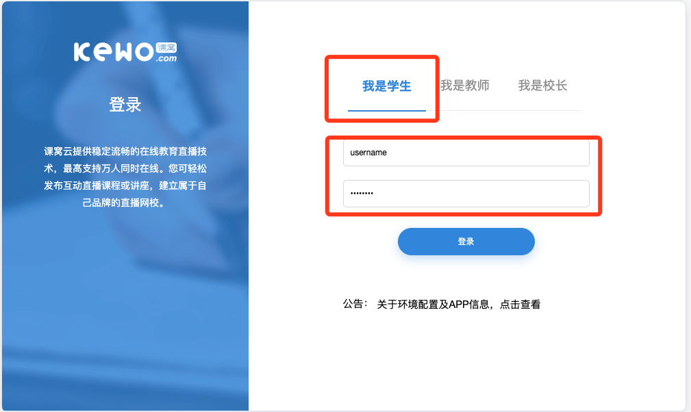

环境配置
###################
直播平台运行环境系统包括Windows/Mac两个平台，需要安装相关浏览器及Adobe Flash Player插件。

IOS及安卓平台可以使用“课窝直播”App。

软件安装指南
****************************
以下主要介绍浏览器及相关软件安装步骤及注意事项。

浏览器安装
============================
常用的浏览器有Firefox、Chrome、Edge、Safari等浏览器，推荐安装 **Firefox** 及 **Chrome** 两款浏览器。

.. note::

    + Firefox及Chrome浏览器比较稳定方便；
    + Firefox浏览器对于Flash限制较少，默认开启；
    + Chrome浏览器默认禁用Flash,需要开启操作。

Firefox浏览器
----------------------------
下载地址
    http://www.firefox.com.cn/

Mac 平台
    1. 下载软件安装包；

    .. image:: _static/env-firefox-dl.png

    2. 安装软件；
    
        + 双击下载安装包；

        .. image:: _static/env-firefox-inst1.png
        

        + 打开安装包后会出现 安装界面 如下图：

        .. image:: _static/env-firefox-inst3.png

        根据提示，将“firefox”图标拖拽至 Application 文件夹进行安装。

        .. image:: _static/env-firefox-inst3-1.png

        
        + 如果没有出现安装界面，可以打开桌面，找到刚刚解压的安装盘，然后双击打开：

        .. image:: _static/env-firefox-inst2.png
           

    3. 运行软件；

        + 打开“启动台”，然后找到“Firefox”，双击启动浏览器；

        .. image:: _static/env-firefox-inst4.png
           :height: 100 px
           :align: left

        .. image:: _static/env-firefox-inst5.png
           :height: 100 px
           :align: right

        .. image:: _static/env-firefox-inst6.png
           

        + 首次打开会有安全提示提示，选择打开即可

Chrome浏览器
----------------------------
下载地址
    https://www.google.cn/chrome/

Mac 平台
    1. 下载软件安装包；

    .. image:: _static/env-chrome-dl.png

    2. 安装软件；
    
        + 双击下载安装包；

        .. image:: _static/env-chrome-inst1.png
        

        + 打开安装包后会出现 安装界面 如下图：

        .. image:: _static/env-chrome-inst3.png
           :height: 200 px
           

        根据提示，将“chrome”图标拖拽至 Application 文件夹进行安装。

        .. image:: _static/env-chrome-inst3-1.png
           :height: 100 px
           

        
        + 如果没有出现安装界面，可以打开桌面，找到刚刚解压的安装盘，然后双击打开：

        .. image:: _static/env-chrome-inst2.png
           

    3. 运行软件；

        + 打开“启动台”，然后找到“Chrome”，双击启动浏览器；

        .. image:: _static/env-firefox-inst4.png
           :height: 100 px
           :align: left

        .. image:: _static/env-chrome-inst5.png
           :height: 100 px
           :align: right

        .. image:: _static/env-chrome-inst6.png
           

        + 首次打开会有安全提示提示，选择打开即可

.. _flash-install-label:

Flash安装
============================
直播平台的课程教室依赖于Adobe Flash Player插件运行。

.. note::

    + Firefox浏览器对于Flash限制较少，默认开启；
    + Chrome浏览器默认禁用Flash,需要开启操作。

下载地址
    https://www.flash.cn/

Mac 平台
    1. 下载软件安装包；

    .. image:: _static/env-flash-dl.png

    2. 安装软件；
    
        + 双击下载安装包；

        .. image:: _static/env-flash-inst1.png
        

        + 打开安装包后会出现 安装界面 如下图：

        .. image:: _static/env-flash-inst3.png
           :height: 200 px
           

        双击“Flah”图标，进行安装，部分电脑会弹出安全提示，选择“打开”即可

        .. image:: _static/env-flash-inst3-1.png
           :height: 200 px
           
        
        + 选中“协议条款”，然后点击安装；

        .. image:: _static/env-flash-inst3-2.png
           :height: 200 px
           

        + 安装完成之后，需要输入Mac的用户密码确认；

        .. image:: _static/env-flash-inst3-3.png
           :height: 200 px
           

        + 点击完成，然后重新启动浏览器。

        .. image:: _static/env-flash-inst3-4.png
           :height: 200 px
           

Teamviewer
============================
Teamviewer远程软件可以很好的方便设备调试，该软件可以选择性安装。

.. note::

    + 远程软件可以很好的方便技术人员远程调试设备

下载地址
    https://www.teamviewer.cn/cn/

Mac 平台
    1. 下载软件安装包；

    .. image:: _static/env-team-dl.png

    2. 安装软件；
    
        + 双击下载安装包；

        .. image:: _static/env-team-inst1.png
        

        + 打开安装包后会出现 安装界面 如下图：

        .. image:: _static/env-team-inst3.png
           :height: 200 px
           

        双击图标，进行安装

        .. image:: _static/env-team-inst3-1.png
           :height: 200 px
           

    3. 运行软件；

        + 打开“启动台”，然后找到“Firefox”，双击启动浏览器；

        .. image:: _static/env-firefox-inst4.png
           :height: 100 px
           :align: left

        .. image:: _static/env-team-inst5.png
           :height: 100 px
           :align: right

        .. image:: _static/env-team-inst6.png
           

      将 如图所示“ID”"密码"，发送给技术人员即可。

向日葵
============================
向日葵远程软件可以很好的方便设备调试，该软件可以选择性安装。

.. note::

    + 远程软件可以很好的方便技术人员远程调试设备

下载地址
    https://sunlogin.oray.com/personal/download/

Mac 平台
    1. 下载软件安装包；

    .. image:: _static/env-sun-dl.png

    2. 安装软件；
    
        + 双击下载安装包；

        .. image:: _static/env-sun-inst1.png

        双击图标，进行安装

        .. image:: _static/env-team-inst3.png
           :height: 200 px
           

    3. 运行软件；

        + 打开“启动台”，然后找到“Firefox”，双击启动浏览器；

        .. image:: _static/env-firefox-inst4.png
           :height: 100 px
           :align: left

        .. image:: _static/env-sun-inst5.png
           :height: 100 px
           :align: right

        .. image:: _static/env-sun-inst6.png
           

      将 如图所示“ID”，发送给技术人员即可。

.. _env-test-label:

环境测试
****************************
在将相关软件安装好之后，打开浏览器，地址栏输入 课窝直播地址（class.kewo.com）,然后进行登录。

登录地址 http://class.kewo.com

环境测试
   平台登录之后，在界面右上角有“**环境测试**”按钮，主要用来检测flah及外放、麦克风是否可用。

   + 点击“环境测试” chrome://settings/content/flash

   .. image:: _static/env-test-1.png

   + 进入环境检测界面，需要先接好外放及耳麦，然后点击开始

   .. image:: _static/env-test-2.png

   .. image:: _static/env-test-2-1.png

   + 进入环境测试界面，点击允许，然后播放，测试麦克风等

   .. image:: _static/env-test-3.png

   部分浏览器会出现 flahs崩溃、按钮点击无效果等情况，一般是浏览器阻拦了flash,需要点击开启。

   如图，点击地址栏右侧图标查看

   .. image:: _static/env-test-3-1.png

   点击图标，会出现一个flash提醒，然乎点击“**管理**”

   .. image:: _static/env-test-3-3.png

   如果没有出现弹框，可以打开新标签页，然后在地址栏输入:

   chrome://settings/content/flash

   进入浏览器Flash配置界面：

   .. image:: _static/env-test-3-2.png

   选择允许，然后切换至 课程界面，刷新当前页面。

   .. note::

      + 部分浏览器会直接阻断Flash插件，根据上述方式设置后，需要重新刷新页面或者重启浏览器；
      + 个别浏览器或者网络下，环境测试在测试网络情况的时候会卡住，这并不妨碍上课，直接关掉当前页面，进入课堂即可。

.. _flash-set-label:

浏览器Flash配置
**************************************
Chrome浏览器及基于Chromium的浏览器会默认禁用掉Flash插件，所以需要提前配置一下。

问题复现
   部分使用Flash的网站在请求Flash权限的时候会有如下提示,当你点击 “**flash**”图标，或者自定义的Flash启动按钮的时候
   在地址栏或弹出一个插件被阻止的提示，第一次会直接扩展提示，后边再次点击只会显示提示ICON,很不容易被发觉。

   .. image:: _static/env-setflash-1.png

   .. image:: _static/env-setflash-2.png

配置方式1
   在地址栏有这种提示的时候，点击地址栏右侧的插件ICON，会弹出插件配置的flash弹框，然后点击 “**管理**“ 按钮，进入FLah管理界面。

   如果没有显示该ICON, 可以在地址栏直接输入 chrome://settings/content/flash 进入

   .. image:: _static/env-test-3-3.png

   在Flash管理界面，将“禁止网站运行Flash"，改为“先询问”

   .. image:: _static/env-test-3-2.png

   然后切换回之前的页面，刷新下页面，然后再点击启动Flash按钮，会在左上角提示 “是否运行FLash”，选择允许

   如果没有提示，请重启浏览器，然后在点击相关按钮。

   .. image:: _static/env-setflash-3.png

配置方式2
   部分版本浏览器可以直接在地址栏针对当前域名进行设置，如果没有如下图提示，请参考“配置方式1”进行设置

   点击地址栏左侧的“小锁🔒”

   .. image:: _static/env-setflash-4.png

   然后将 flash、摄像头、麦克风 等配置项都设置为允许

   .. image:: _static/env-setflash-5.png

   设置之后浏览器会提示“重新加载”，点击加载即可

   .. image:: _static/env-setflash-6.png
