常见问题
#####################################

.. _issues-zhen-label:

Windows 设置侦听
=======================================
简单的说，你开启了麦克风侦听功能就可以在讲话时在音箱中听到自己的声音，一般会有延迟问题。

+ 右键单击右下角小喇叭图标，单击“声音”；

.. image:: _static/issue-zhen-1.jpg

+ 单击“录制”选项卡，单击“麦克风🎤”图标，单击“属性”；

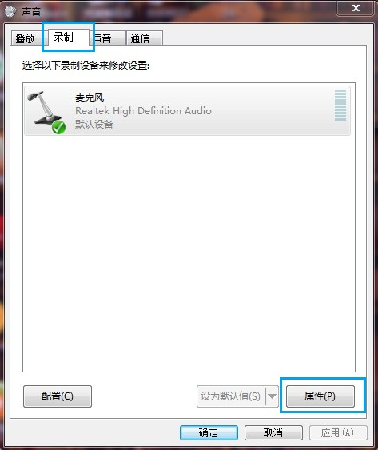

+ 单击“侦听”选项卡，取消“侦听此设备”，应用即可。

.. image:: _static/issue-zhen-3.jpg

.. _issues-flash-label:

Chrome默认禁止Flash设置
==============================================

+ 在进入课堂，或者使用Flash的时候，地址栏会提示“插件已被拦截” 

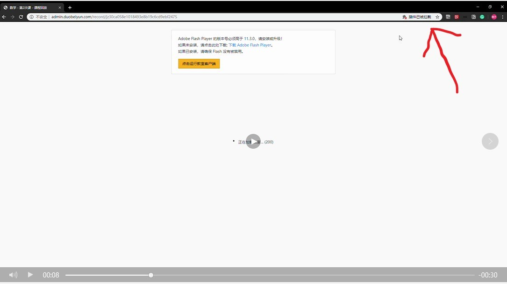

+ 点击地址栏该图标

+ 页面跳转至 设置 您的Flash 设置会一直保留到您退出chrome为止 禁止网站运行Flash(推荐) 点击“开启”

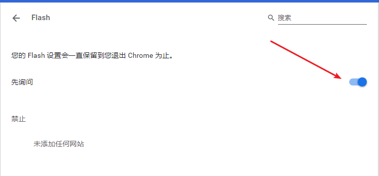

+ 刷新页面，即可成功进入教室

.. _issues-zh-label:

Chrome无法输入中文
===============================================
Chrome给部分用户开启了Site Isolation功能，看起来这个功能和Flash和输入法有冲突

打开 chrome://flags/#site-isolation-trial-opt-out ，把Default改成Opt-out，重启Chrome

参考：https://blog.csdn.net/guawawa311/article/details/88682756

.. _issues-zhan-label:

Windows取消麦克风独占模式
=================================================
独占模式主要是针对多个程序都在使用麦克风时的优先设置，即当同时存在多个使用麦克风的程序时(常见如qq，yy语音)，如果开启麦克风独占模式的话会对讲课效果有影响，如出现怪声，模糊不清等

+ 右键点击任务栏声音合成器

.. image:: _static/issues-zhan-1.jpg

+ 点击录音设备

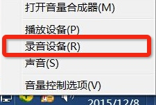

+ 右键点击麦克风，选择属性

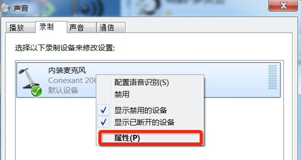

+ 点击高级

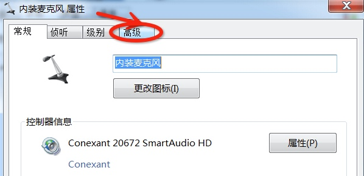

+ 将独占模式内的两个选项的钩去掉，如下图

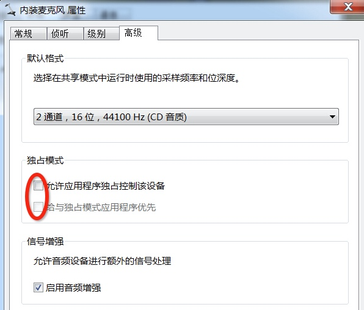

+ 点击确定按钮，完成设置

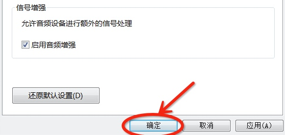

.. _issues-room-flash-label:

教室内设置Flah
=======================================
正常情况下，在第一次进入教室时，会提示用户允许教室访问用户的麦克风和摄像头，如下图所示

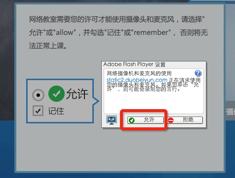

如果不允许flash或者浏览器访问均会造成无法发布音频及视频，使用户无法正常上课

如果用户没有在刚进入教室时选择允许教室访问麦克风及摄像头，并且已经进入教室中，可采用如下方式允许

+ 在教室内ppt区域右键，并选择设置选

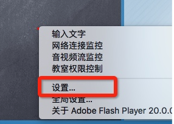

+ 在弹出的窗口内点击允许，并记住该选项

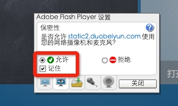

+ 重启浏览器即可

.. _issues-num-label:

教室状态说明
======================================

+ 如果状态更新到203，页面的状态会停在203， 用户无法正常进入教室。表示用户网络有问题，三个 swf 备份都失败

+ 如果多次网络连接失败，请点击测试网络。一般造成这种问题的原因是RTMP协议被禁用。按照提示测试网络后，会给出结论

.. _issues-dns-label:

DNS刷新
======================================

特殊情况下站点服务器迁移，或者电脑DNS失效，需要刷新。参考：https://blog.csdn.net/guawawa311/article/details/103437421