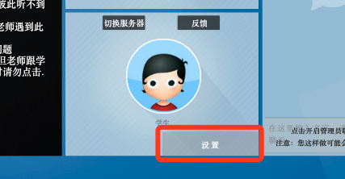

PC端常见问题
############################
直播平台在Mac/Windows平台使用过程中，常见问题及解决方案

无法进入课堂
============================

Flash 未安装或者过期
----------------------------

具体情况
    在进入课堂后，运行不了Flash,或者Flash显示已过期。

    提示已过期

    .. image:: _static/pc-flash-1.png

    或者提示200

    .. image:: _static/pc-flash-2.png
    

    或者提示203

    .. image:: _static/pc-flash-3.png

原因分析
    一般是未安装Flash，或者Flash官方已经更新，本地版本过期。

解决方案
    重新安装 `Flash <https://www.flash.cn/>`_ ,然后重启浏览器，进入课堂。

    FLash下载地址 ：https://www.flash.cn/

    具体安装调试方式参考：:ref:`flash-install-label`

Flash无法启动
----------------------------

具体情况
    确认已经安装了Flah的情况下，进入课堂提示黄色按钮“**点击运行客户端**”

    .. image:: _static/env-setflash-2.png

原因分析
    Chrome浏览器及基于Chromium的浏览器会默认禁用掉Flash插件,需要重新配置下。

解决方案
    点击地址栏的“插件禁用ICON”,然后点击“管理“,将Flash设置为“询问”，设置好之后切换回课堂页面，刷新页面

    详细步骤参考：:ref:`flash-set-label`

外放没有声音
=============================

静音状态
-----------------------------

原因分析
    部分PC机在之前使用过程中设置了静音，或是连接过其他**蓝牙设备**，导致外放没有声音。

解决方案
    + 首先检查是否设置了静音🔇，按键盘上的音量键或者是点击桌面右下角的音量图标

    .. image:: _static/pc-volume-1.jpg

    + 其次检测是否外接了其他音响设备，外设是否开启

    + 直接接入耳机测试是否有声音

    + 进入课堂，点击头像处的设置按钮，点击“开始试听”按钮，观察是否有声音

    .. image:: _static/pc-volume-2.png

当前设备未选中
------------------------------

原因分析
    个别电脑接了其他外放设备，未使用或者，播放通道设置有误

解决方案
    + 直接接入耳机测试是否有声音

    + 进入课堂，点击头像处的设置按钮，选择扬声器一栏，点击“开始试听”按钮，观察是否有声音

    .. image:: _static/pc-volume-2.png

    Mac平台
        麦克风系统管理位于 “系统偏好设置”

        + 点击屏幕左上角的 “苹果🍎”ICON,然后选择“系统偏好设置”，
          或者点击“程序坞”中的 “齿轮⚙️”，打开“系统偏好设置”

        .. image:: _static/pc-volume-8.png

        + 点击“声音”ICON,然后选择“输出”选项进行设置。

        .. image:: _static/pc-volume-10.png

    Windows平台
        + Win10设备查看外放通道，右击外放ICON🔊，打开声音设置界面

        .. image:: _static/pc-volume-3.png

        + 在选择输出设备一栏，选择当前正在运行的设备，然后在左右滑动音量，查看音量条是否有扰动，外放是否有声音

        .. image:: _static/pc-volume-4.png

        或者点击“管理声音设备”，进入设备管理界面，点击“测试”，查看是否禁用，是否有声音

        .. image:: _static/pc-volume-5.png

麦克风无声音 
==============================================   

外接设备
----------------------------------------------

原因分析
    部分台式机没有内置麦克风，外接麦错误或者麦克风被静音

解决方案

    + 双头耳麦是否接反，根据机箱或者是笔记本上印的标记重新接入，一般绿色的为外放，红色的为麦

    + 如果是单孔耳麦接口，检查耳机接头是否为4段，一般手机用耳机都为4段通讯耳机

    + 3.5mm耳机有OMTP及CTIA两个标准，主要区别是在与 接头的4段中 麦克风插针的位置，连接不兼容的耳机可能会导致没有声音或者异响

    .. image:: _static/pc-volume-6.png

.. _pc-mic-label:

系统设置
-----------------------------------------------

原因分析
    麦设备被静音🔇，或者活动设备选择不匹配

解决方案
    + 进入课堂，点击头像处的设置按钮，选择麦克风一栏，下拉框中选择设备，然后对着麦说几句话测试，查看底部音量条是否抖动，
      并倾听外放有没有返回声音

    .. image:: _static/pc-volume-7.png

    + 如果没有声音，重新插拔一下麦克风，然后重启浏览器进入课堂

    Mac平台
        麦克风系统管理位于 “系统偏好设置”

        + 点击屏幕左上角的 “苹果🍎”ICON,然后选择“系统偏好设置”，
          或者点击“程序坞”中的 “齿轮⚙️”，打开“系统偏好设置”

        .. image:: _static/pc-volume-8.png

        + 点击“声音”ICON,然后选择“输入”选项进行设置。

        .. image:: _static/pc-volume-9.png

    Windows平台
        右击屏幕右下角的 喇叭🔊 ICON,然后选择声音设置

        .. image:: _static/pc-volume-3.png

        然后选择 “输入”，设置输入设备及测试设备是否可用

        .. image:: _static/pc-volume-11.png

.. _issue-check-label:

课堂问题定位
=====================================

首先需要确定是哪方的问题，需要教务介入，或者老师学生自行确定，原理相同。

+ 进入课堂（监课）

.. image:: _static/pc-noise-1.png

+ 首先确定是否能过听到双方的声音，听不到声音的一方肯定设备有问题，需要配置

+ 如果双方都有声音，但是课堂有回音，点击学生头像旁边的设置按钮

教务/老师 在设置学生的相关配置时，学生端会有弹框提示，需要通知学生点击确认

.. image:: _static/pc-noise-3.png

+ 在学生端确认之后，将学生端的麦克风音量设置为0，然后点击确认

+ 同时老师端继续讲话，然后倾听课堂是否还有回音

+ 同样的方式，可以设置教师端麦克风音量为0，同时测试学生端设备

回音/单方静音
===============================================

老师端有回音
-----------------------------------------------

首先进行问题端判定：:ref:`issue-check-label`

原因分析
    一般出现这种情况是，两端都有声音，但是一端将另一端的声音通过自身的麦有回传到系统，导致回音出现。

解决方案
    + 先接入耳机，检查是否还会出现问题

    + 检查外放是否直接对着麦，转换外放角度

    + 外放音量不要过高

    + 尽量不要处于空旷的房间

本端有回音
-----------------------------------------------

首先进行问题端判定：:ref:`issue-check-label`

解决方案
    + 先接入耳机，检查是否还会出现问题

    + 检查外放是否直接对着麦，转换外放角度

    + 外放音量不要过高

    + 查看是否在课堂界打开了“设备”界面

    + Windows平台，查看是否开启了侦听，关闭侦听，然后重启浏览器 :ref:`issues-zhen-label`

    + Windows平台，检查麦克风是否有独占 :ref:`issues-zhan-label`

单方静音
-----------------------------------------------------

首先进行问题端判定：:ref:`issue-check-label`

解决方案
    + 先接入耳机，检查是否还会出现问题

    + 依据环境测试步骤，检测是否已经启用麦克风 :ref:`env-test-label`

    + 依据麦克风设置，检测激活状态设备，或者接入新设备 :ref:`pc-mic-label`

